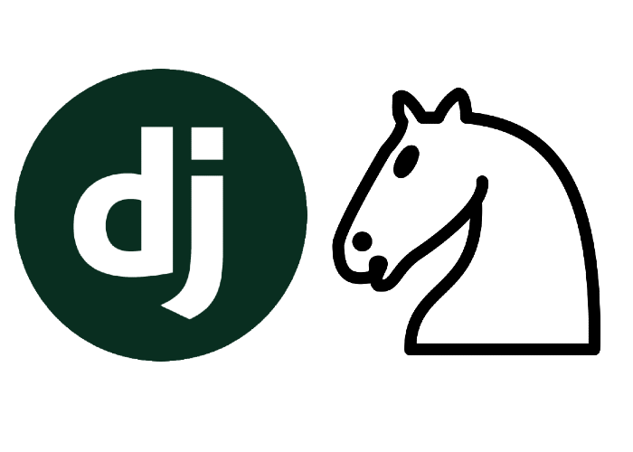
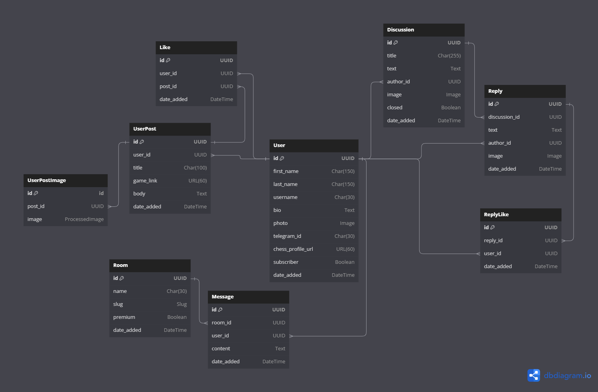

<a name="readme-top"></a>
<!-- PROJECT LOGO -->
<br />
<div align="center">
  <a href="https://github.com/MishaVyb/weather-collector">
    
  </a>

<h3 align="center">Chess Forum</h3>

  <p align="center">
    Django project: chess forum concept.
    <br />
    <a href="#getting-started"><strong>Explore Getting Started topic »</strong></a>
    <br />
  </p>
</div>


<!-- TABLE OF CONTENTS -->
<details>
  <summary>Table of Contents</summary>
  <ol>
    <li>
      <a href="#features">Features</a>
    </li>
    <li>
      <a href="#getting-started">Getting Started</a>
      <ul>
        <li><a href="#prerequisites">Prerequisites</a></li>
      </ul>
    </li>
    <li><a href="#explanations">Explanations</a></li>
    <li><a href="#license">License</a></li>
    <li><a href="#contacts">Contacts</a></li>
  </ol>
</details>


## Features
- Main page with information of the most liked posts and open discussions.
- Chats section.
- Page with posts where user can sort posts by date added or most likes.
- Discussions where users can discus, and if author receives a reply, they can close the discussion.
- Profiles containing information about the user, including their bio, photo, Telegram ID, chess profile URL, information about whether the user is a subscriber, user's posts, and posts liked by the user and authors can edit their profile and posts.

## Technology Stack


# Getting Started

## Run docker compose.
### Prerequisites
* Docker **24.0.6**

1. Clone the repo.
   ```sh
   $ git clone git@github.com:YuriiDorosh/chess-forum.git
   ```
2. Define environment variables
    ```sh
      $ cd chess-forum
      $ nano .env
    ```
    ```env
    SECRET_KEY=my_django_key
    POSTGRES_DB=my_database
    POSTGRES_USER=my_database_user
    POSTGRES_PASSWORD=my_database_password
    ```

3. Build and run docker compose by predefined `make` command.
    ```sh
    $ make setup
    ```
    > WARNING! <br>
    > If database connection fails, try again in a few seconds. It could be because postress server is not running yet.


## Run as python script.
### Prerequisites

* python **3.10**
* pip


### Installation

1. Clone the repo.
   ```sh
   $ git clone git@github.com:YuriiDorosh/chess-forum.git
   ```
2. Activate virtual environment.
   ```sh
   $ cd chess-forum
   $ python3 -m venv venv
   $ source venv/bin/activate

3. Install requirements.
    ```sh
   (venv) $ pip install -r requirements.txt
   ```

4. Define environment variables
    ```sh
      $ nano .env
    ```
    ```env
    SECRET_KEY=my_django_key
    POSTGRES_DB=my_database
    POSTGRES_USER=my_database_user
    POSTGRES_PASSWORD=my_database_password
    ```
<p align="right">(<a href="#readme-top">back to top</a>)</p>


## Explanations

1. Database Structure.
    

    `User` <br>
    Inheritance of the model from AbstractUser.
    
    Includes the following information about the user: first name, last name, username, user bio (optional field), user photo (optional field), telegram user id (optional field), link to chess profile (optional field), whether the user is a subscriber to the service (by default False), and the date when the user was registered.

    `UserPost`<br>
    Model inheritance from BaseModel. 

    Includes the following information about the user post: user id, post title, game link(optional field), body of post, and the date when the post was added.

    `Like`<br>
    Model inheritance from BaseModel. 
    
    Includes the following information: user id, post id, date added.

    `UserPostImage`<br>
    Model inheritance from Model. 
    
    Includes the following information: post id, image

    `Room`<br>
    Model inheritance from BaseModel. 
    
    Includes the following information about the room: name, slug, if the room is premium(by default False), and the date when the room was created.

    `Message`<br>
    Model inheritance from BaseModel. 
    
    Includes the following information: room id, user id, content of the message, and date when user write the message. 

    `Discussion`<br>
    Model inheritance from BaseModel. 
    
    Includes the following information about the discussion: title of the discussion, text, author(user) id, image(optional field), closed(by default False), and the date when discussion was created. 
    
    `Reply`<br>
    Model inheritance from BaseModel. 
    
    Includes the following information about the reply: discussion id, text, author id, image(optional field), and the date when reply was writing. 

    `ReplyLike`<br>
    Model inheritance from BaseModel. 
    
    Includes the following information about: reply id, user id, date added.

## License

This project is licensed under the MIT License. You can find the license details in the [LICENSE](LICENSE) file. Feel free to use, modify, and distribute the code as per the terms of the MIT License.

## Contacts

Yurii Dorosh

[](https://t.me/s11nd8r)<br>
[](mailto:contact.yuriidorosh@gmail.com)
<p align='left'>

<p align="right">(<a href="#readme-top">back to top</a>)</p>