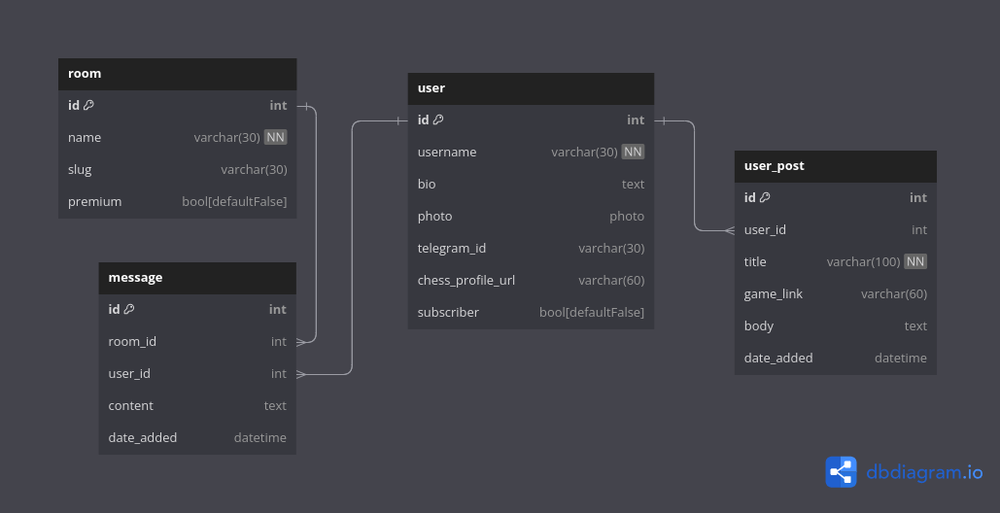

```bash
sudo docker system prune -a
sudo docker-compose down --rmi all
```

```bash
sudo docker-compose build
```

```bash
sudo docker-compose up
```

```bash
sudo docker-compose run --rm web sh -c "python manage.py makemigrations"
```

```bash
sudo docker-compose run --rm web sh -c "python manage.py migrate"
```

```bash
sudo docker-compose run --rm web sh -c "python manage.py createsuperuser"
```




## 🛠 Technology Stack


